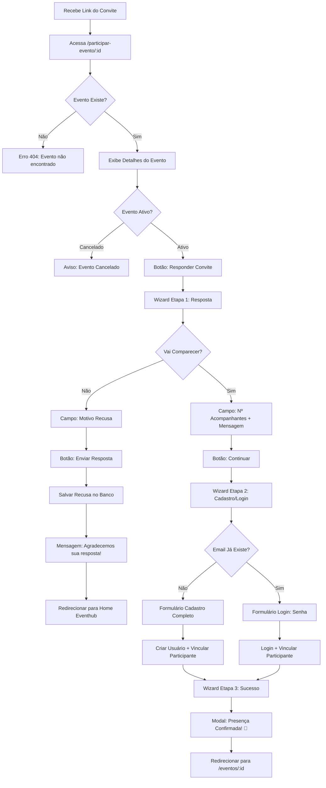

# User History - Confirmação de Presença via Link de Convite

## 1. Informações Gerais

- **ID:** US-011
- **Título:** Confirmação de Presença via Link de Convite
- **Módulo:** confirmacao-convite
- **Prioridade:** Alta
- **Estimativa:** G (Grande)
- **Dependências:** Nenhuma

---

## 2. História do Usuário

**Como** convidado de um evento,  
**Quero** confirmar minha presença através de um link único enviado pelo organizador,  
**Para** informar se vou comparecer, quantos acompanhantes levarei e me cadastrar na plataforma.

---

## 3. Critérios de Aceite

### 3.1 Cenário 1: Visualização do Convite

**DADO** que recebo o link do convite por email/WhatsApp  
**QUANDO** acesso o link `/participar-evento/{idEvento}`  
**ENTÃO** o sistema exibe uma página pública com detalhes do evento

**E** vejo: nome do evento, data, local, mensagem do organizador  
**E** vejo botão "Responder Convite" destacado

#### 3.1.1 Informações Adicionais
- **Validações:**
  - Link deve funcionar sem autenticação prévia
  - Se evento não existir, exibir mensagem de erro elegante: "Evento não encontrado ou link inválido"
  - Se evento estiver cancelado, exibir aviso: "Este evento foi cancelado"
  - Validar se `idEvento` é um número válido
- **Comportamento:**
  - Layout segue padrão Eventhub com tema clean e profissional
  - Exibe imagem de capa do evento se disponível (ou imagem placeholder)
  - Botão CTA primário com destaque visual (cor primária do tema)
  - Página responsiva (mobile-first)
  - Carregamento com skeleton/shimmer enquanto busca dados
- **Feedback:**
  - Mensagem clara e convidativa: "Você foi convidado(a) para participar deste evento!"
  - Layout acolhedor que incentiva a resposta ao convite

### 3.2 Cenário 2: Confirmação de Presença - Aceitar Convite

**DADO** que cliquei em "Responder Convite"  
**QUANDO** seleciono "Sim, vou comparecer"  
**ENTÃO** o sistema exibe campo "Número de Acompanhantes" (numérico)

**E** o campo respeita limite definido pelo organizador no evento  
**E** exibe campo "Mensagem para o Organizador" (opcional, textarea)  
**E** botão "Continuar" aparece habilitado

#### 3.2.1 Informações Adicionais
- **Validações:**
  - Número de acompanhantes deve ser >= 0
  - Não pode exceder limite configurado pelo organizador (`evento.limiteAcompanhantes`)
  - Se limite for 0, campo não aparece ou aparece desabilitado
  - Mensagem opcional com máximo 500 caracteres
  - Contador de caracteres regressivo para mensagem
- **Comportamento:**
  - Usar stepper/wizard moderno para visualizar etapas (Etapa 1 de 3)
  - Validação em tempo real dos campos
  - Indicador visual de progresso claro
  - Transição suave entre etapas com animação sutil
  - Campo de acompanhantes com spinner (+/-) ou input numérico
- **Feedback:**
  - Se exceder limite: "O organizador permite no máximo X acompanhante(s)"
  - Se valor < 0: "Número de acompanhantes deve ser maior ou igual a zero"
  - Contador de caracteres: "500/500 caracteres restantes"
  - Placeholder mensagem: "Deixe uma mensagem especial para o organizador (opcional)"

### 3.3 Cenário 3: Recusa de Convite

**DADO** que cliquei em "Responder Convite"  
**QUANDO** seleciono "Não vou comparecer"  
**ENTÃO** o sistema exibe campo "Motivo da Recusa" (opcional, textarea)

**E** exibe botão "Enviar Resposta"  
**E** ao enviar, atualiza status para "Recusado" no banco de dados  
**E** exibe mensagem de confirmação  
**E** redireciona para home do Eventhub após 3 segundos

#### 3.3.1 Informações Adicionais
- **Validações:**
  - Motivo é opcional (não bloqueia envio)
  - Máximo 300 caracteres
  - Se preenchido, mínimo 10 caracteres
- **Comportamento:**
  - Não pede cadastro se recusar o convite
  - Salva resposta de recusa mesmo sem cadastro completo do usuário
  - Layout empático e compreensivo (não punitivo)
  - Animação de feedback de envio
- **Feedback:**
  - Mensagem de agradecimento: "Agradecemos sua resposta! O organizador foi notificado."
  - Toast de sucesso antes do redirecionamento
  - Contador regressivo visível: "Redirecionando em 3... 2... 1..."

### 3.4 Cenário 4: Cadastro de Novo Usuário após Confirmar Presença

**DADO** que confirmo presença e clico em "Continuar"  
**QUANDO** ainda não sou cadastrado na plataforma  
**ENTÃO** o sistema exibe formulário de cadastro simplificado

**E** campos: Nome, Email, Senha, Confirmar Senha, Telefone (opcional)  
**E** ao submeter, cria usuário E vincula como participante confirmado do evento  
**E** exibe mensagem de sucesso  
**E** redireciona para home do evento (`/eventos/{id}`)

#### 3.4.1 Informações Adicionais
- **Validações:**
  - **Nome**: obrigatório, mínimo 3 caracteres, máximo 100 caracteres
  - **Email**: obrigatório, formato válido (regex), não pode ser duplicado
  - **Senha**: obrigatória, mínimo 6 caracteres, máximo 50 caracteres
  - **Confirmar Senha**: deve ser igual à senha
  - **Telefone**: opcional, formato (99) 99999-9999 com máscara automática
  - Todas as validações com mensagens específicas
- **Comportamento:**
  - Indicador visual de progresso: "Etapa 2 de 3 - Criar Conta"
  - Senhas com toggle de visibilidade (ícone olho)
  - Validação em tempo real (blur e input)
  - Desabilitar botão "Cadastrar" durante processamento
  - Loading spinner no botão: "Cadastrando..."
  - Transação atômica: usuário + participante + confirmação (rollback se falhar)
- **Feedback:**
  - Sucesso: Modal com checkmark animado + "Cadastro realizado! Sua presença foi confirmada"
  - Erro específico por campo com ícone
  - Email duplicado: "Este email já está cadastrado. Faça login na próxima etapa."
  - Senhas não coincidem: "As senhas não coincidem"

### 3.5 Cenário 5: Login de Usuário Existente

**DADO** que confirmo presença e clico em "Continuar"  
**QUANDO** digito um email que já está cadastrado  
**ENTÃO** o sistema detecta automaticamente que email já existe

**E** exibe campo de senha para login (oculta "Confirmar Senha")  
**E** ao fazer login com sucesso, vincula como participante confirmado  
**E** redireciona para home do evento

#### 3.5.1 Informações Adicionais
- **Validações:**
  - Detecção automática ao sair do campo email (evento onBlur/change)
  - Delay de 500ms para evitar requisições excessivas
  - Senha obrigatória se email já existir
  - Validar credenciais antes de vincular ao evento
  - Não permitir duplicação de participante
- **Comportamento:**
  - Transição suave e automática de cadastro para login
  - Mensagem amigável: "Identificamos que você já tem cadastro. Digite sua senha:"
  - Campo "Confirmar Senha" desaparece com animação
  - Botão muda de "Cadastrar" para "Entrar"
  - Botão "Esqueci minha senha" disponível (abre modal de recuperação)
  - Loading no botão: "Entrando..."
- **Feedback:**
  - Detecção de email: Badge ou ícone "✓ Email cadastrado"
  - Erro de senha: "Senha incorreta. Tente novamente ou clique em 'Esqueci minha senha'"
  - Sucesso: "Login realizado! Sua presença foi confirmada ✓"
  - Se já for participante: "Você já confirmou presença anteriormente"

### 3.6 Cenário 6: Confirmação Final

**DADO** que cadastro/login foi concluído com sucesso  
**QUANDO** sistema vincula participante ao evento  
**ENTÃO** atualiza registro no banco com status "Confirmado"

**E** salva número de acompanhantes e mensagem para organizador  
**E** exibe modal/página de sucesso com resumo  
**E** redireciona automaticamente para home do evento após 3 segundos

#### 3.6.1 Informações Adicionais
- **Validações:**
  - Garantir transação atômica: (usuário + participante + confirmação)
  - Rollback completo se qualquer etapa falhar
  - Não permitir duplicação de confirmação para mesmo email/evento
  - Verificar integridade dos dados antes de salvar
- **Comportamento:**
  - Animação de sucesso elegante (checkmark expandindo)
  - Resumo visual da confirmação:
    - "Você + X acompanhante(s)"
    - Nome do evento
    - Data do evento
  - Contador regressivo visível: "Redirecionando em 3..."
  - Botão "Ir para o Evento" para redirecionar imediatamente
  - Confete/celebração sutil (opcional, tema)
- **Feedback:**
  - Título: "Presença confirmada com sucesso! 🎉"
  - Mensagem: "Aguardamos você no evento. Verifique seu email para mais detalhes."
  - Card de resumo com ícones e cores do tema

---

## 4. Regras de Negócio

### RN-001: Limite de Acompanhantes Configurável
**Descrição:** O limite de acompanhantes é definido pelo organizador ao criar ou configurar o evento através do campo `limiteAcompanhantes` no model `Evento`.

**Justificativa:** Organizador precisa controlar capacidade do local, orçamento de catering e planejamento logístico do evento.

**Exceções:** 
- Se limite for 0, campo de acompanhantes não aparece ou aparece desabilitado
- Se limite for null/undefined, sistema assume valor padrão de 3

### RN-002: Recusa Não Requer Cadastro
**Descrição:** Convidado que recusar o convite não precisa se cadastrar como usuário na plataforma. Sistema salva apenas resposta de recusa com dados mínimos.

**Justificativa:** Não forçar cadastro completo para quem não vai participar, melhorando UX e taxas de resposta.

**Exceções:** 
- Resposta de recusa é salva para controle do organizador
- Dados: email (se fornecido), status "Recusado", motivo (opcional)

### RN-003: Impossibilidade de Edição após Confirmação
**Descrição:** Convidado não pode editar resposta após confirmação. Para mudanças, deve contatar organizador diretamente via chat/email do evento.

**Justificativa:** Evitar mudanças de última hora que prejudiquem planejamento (catering, assentos, brindes).

**Exceções:** 
- Funcionalidade futura: permitir edição até X dias antes do evento
- Organizador pode alterar manualmente pelo painel administrativo

### RN-004: Detecção Automática de Email Cadastrado
**Descrição:** Sistema detecta automaticamente (onBlur do campo email) se o email digitado já está cadastrado na plataforma, redirecionando para fluxo de login.

**Justificativa:** Evitar duplicação de usuários, facilitar login de usuários recorrentes e melhorar experiência.

**Exceções:** 
- Se API de verificação falhar, assume fluxo de cadastro (tratamento de erro silencioso)
- Delay de 500ms para evitar múltiplas requisições

### RN-005: Vínculo Automático como Participante
**Descrição:** Confirmação vincula automaticamente usuário como "Participante" do evento (perfil específico, não é organizador).

**Justificativa:** Integrar convidado ao sistema de gestão do evento, permitindo acesso a lista de presentes, chat, etc.

**Exceções:** 
- Se usuário já for organizador do evento, mantém perfil de organizador
- Um usuário pode ser participante de múltiplos eventos

### RN-006: Link Público Sem Autenticação Prévia
**Descrição:** Link do convite (`/participar-evento/:id`) é público e não requer autenticação prévia para visualização inicial.

**Justificativa:** Facilitar acesso de novos usuários e remover barreiras de entrada.

**Exceções:** 
- Impede acesso se evento não existir (404)
- Impede acesso se evento estiver cancelado (mensagem específica)
- Funcionalidade futura: eventos privados com senha

### RN-007: Notificação ao Organizador
**Descrição:** Sistema envia notificação em tempo real para organizador(es) do evento quando convidado confirma ou recusa presença.

**Justificativa:** Manter organizadores informados sobre status de confirmações para planejamento adequado.

**Exceções:** 
- Se organizador desabilitar notificações nas configurações (funcionalidade futura)
- Notificações agrupadas se múltiplas confirmações em curto período

### RN-008: Transação Atômica de Cadastro
**Descrição:** Ao confirmar presença, sistema executa transação atômica que cria usuário, vincula como participante e registra confirmação. Se qualquer etapa falhar, sistema faz rollback completo.

**Justificativa:** Garantir integridade dos dados e evitar estados inconsistentes (usuário criado mas não vinculado ao evento).

**Exceções:** Nenhuma

### RN-009: Status de Confirmação
**Descrição:** Sistema mantém status de confirmação no model `Participante` com valores: "Pendente", "Confirmado", "Recusado". Status inicial é sempre "Pendente" ao enviar convite.

**Justificativa:** Permitir controle e relatórios de confirmações para organização do evento.

**Exceções:** 
- Organizador pode mudar status manualmente
- Status pode ser "Cancelado" se evento for cancelado

---

## 5. Campos da Interface

### 5.1 Tela: Visualização do Convite (`/participar-evento/:id`)

| Campo | Descrição | Tipo | Obrigatório | Comportamento |
| :--- | :--- | :--- | :--- | :--- |
| **Imagem de Capa** | Foto/banner do evento | Image | Não | Exibe imagem do evento ou placeholder. Responsivo. |
| **Nome do Evento** | Título do evento | Text (readonly) | Sim | Fonte grande, destaque, centralizado |
| **Data/Período** | Data única ou período (início - fim) | Text (readonly) | Sim | Formato: "12 de Agosto de 2024" ou "12 a 15 de Agosto" |
| **Horário** | Hora de início | Text (readonly) | Não | Formato: "18:00h" |
| **Local** | Endereço completo do evento | Text (readonly) | Não | Ícone de localização + endereço formatado |
| **Mensagem do Organizador** | Mensagem personalizada de boas-vindas | Text (readonly) | Não | Card destacado, estilo citação, fonte diferenciada |
| **Botão CTA** | Ação principal | Button | Sim | Label: "Responder Convite", cor primary, tamanho grande, ícone calendar_check |

### 5.2 Tela: Resposta ao Convite (Etapa 1 - Wizard)

| Campo | Descrição | Tipo | Obrigatório | Validação | Comportamento |
| :--- | :--- | :--- | :--- | :--- | :--- |
| **Vai Comparecer?** | Opções de resposta | Radio Group | Sim | required | Opções: "Sim, vou comparecer" / "Não vou comparecer". Visual destacado. |
| **Número de Acompanhantes** | Quantidade de acompanhantes | Number (spinner) | Condicional | min: 0, max: evento.limiteAcompanhantes | Exibir apenas se selecionou "Sim". Placeholder: "0" |
| **Mensagem para o Organizador** | Mensagem livre | Textarea | Não | maxLength: 500 | Exibir apenas se "Sim". Placeholder: "Deixe uma mensagem (opcional)". Rows: 4. Contador de caracteres. |
| **Motivo da Recusa** | Justificativa opcional | Textarea | Não | minLength: 10 (se preenchido), maxLength: 300 | Exibir apenas se selecionou "Não". Placeholder: "Conte o motivo (opcional)". Rows: 3. |

### 5.3 Tela: Cadastro/Login (Etapa 2 - Wizard)

| Campo | Descrição | Tipo | Obrigatório | Validação | Comportamento |
| :--- | :--- | :--- | :--- | :--- | :--- |
| **Nome** | Nome completo do usuário | Text | Sim | required, minLength: 3, maxLength: 100 | Placeholder: "Seu nome completo". Validação em blur. |
| **Email** | Email para cadastro/login | Email | Sim | required, email format | Placeholder: "seu@email.com". Ao sair do campo (onBlur), verificar se já existe. |
| **Senha** | Senha de acesso | Password | Sim | required, minLength: 6, maxLength: 50 | Placeholder: "Crie uma senha segura". Toggle de visibilidade (ícone olho). |
| **Confirmar Senha** | Confirmação da senha | Password | Condicional | required, mustMatch: senha | Placeholder: "Confirme sua senha". Exibir apenas se for novo cadastro. Toggle de visibilidade. |
| **Telefone** | Telefone de contato | Tel | Não | mask: (00) 00000-0000 | Placeholder: "(99) 99999-9999". Máscara automática. Opcional. |

### 5.4 Tela: Confirmação Final (Etapa 3 - Sucesso)

| Campo | Descrição | Tipo | Obrigatório | Comportamento |
| :--- | :--- | :--- | :--- | :--- |
| **Ícone de Sucesso** | Checkmark animado | Icon/Animation | - | Animação de checkmark expandindo com cor de sucesso |
| **Mensagem Principal** | "Presença confirmada!" | Text | Sim | Fonte grande, destaque, cor de sucesso |
| **Resumo** | Card com resumo da confirmação | Card | Sim | Mostra: nome evento, data, você + X acompanhantes, mensagem enviada |
| **Contador Regressivo** | Tempo para redirecionamento | Text | Sim | "Redirecionando em 3... 2... 1..." |
| **Botão Ir Agora** | Redirecionar imediatamente | Button | Não | Label: "Ir para o Evento", cor primary |

---

## 6. Protótipo/Referência Visual

### 6.1 Layout da Visualização do Convite

```
┌─────────────────────────────────────────────────┐
│                                                 │
│         [Imagem de Capa do Evento]              │
│                                                 │
├─────────────────────────────────────────────────┤
│                                                 │
│          🎉 Você foi convidado! 🎉              │
│                                                 │
│            **Chá de Casa Nova**                 │
│                                                 │
│   📅 12 de Agosto de 2024 • 18:00h              │
│   📍 Rua das Flores, 123 - São Paulo, SP        │
│                                                 │
│   ┌─────────────────────────────────────────┐  │
│   │ 💬 Mensagem do Organizador:             │  │
│   │ "Estamos muito felizes em compartilhar  │  │
│   │  este momento especial com vocês!"      │  │
│   └─────────────────────────────────────────┘  │
│                                                 │
│   ┌─────────────────────────────────────────┐  │
│   │      📋 RESPONDER CONVITE               │  │
│   └─────────────────────────────────────────┘  │
│                                                 │
└─────────────────────────────────────────────────┘
```

### 6.2 Layout do Wizard - Etapa 1 (Resposta)

```
┌─────────────────────────────────────────────────┐
│  Responder Convite                       ╳      │
├─────────────────────────────────────────────────┤
│                                                 │
│  ●━━━━━━━━━○━━━━━━━━━○                          │
│  Resposta    Cadastro   Confirmar               │
│                                                 │
│  Você irá comparecer ao evento?                 │
│                                                 │
│  ⚪ Sim, vou comparecer                          │
│  ⚪ Não vou comparecer                           │
│                                                 │
│  [SE SIM]                                       │
│  Número de Acompanhantes                        │
│  ┌──────┐                                       │
│  │  [0] │  ⬆⬇                                   │
│  └──────┘                                       │
│  Máximo: 3 acompanhantes                        │
│                                                 │
│  Mensagem para o Organizador (opcional)         │
│  ┌─────────────────────────────────────────┐   │
│  │ Muito felizes pelo casal! Contamos      │   │
│  │ os dias para a festa.                   │   │
│  └─────────────────────────────────────────┘   │
│  450/500 caracteres                             │
│                                                 │
│  [SE NÃO]                                       │
│  Motivo da Recusa (opcional)                    │
│  ┌─────────────────────────────────────────┐   │
│  │ Infelizmente tenho outro compromisso    │   │
│  └─────────────────────────────────────────┘   │
│  50/300 caracteres                              │
│                                                 │
│         ┌──────────┐  ┌──────────────────┐     │
│         │ Cancelar │  │ ➜ Continuar      │     │
│         └──────────┘  └──────────────────┘     │
│                                                 │
└─────────────────────────────────────────────────┘
```

### 6.3 Layout do Wizard - Etapa 2 (Cadastro)

```
┌─────────────────────────────────────────────────┐
│  Criar Conta                             ╳      │
├─────────────────────────────────────────────────┤
│                                                 │
│  ○━━━━━━━━━●━━━━━━━━━○                          │
│  Resposta    Cadastro   Confirmar               │
│                                                 │
│  Para confirmar sua presença, crie uma conta:   │
│                                                 │
│  Nome Completo *                                │
│  ┌─────────────────────────────────────────┐   │
│  │ João Silva                              │   │
│  └─────────────────────────────────────────┘   │
│                                                 │
│  Email *                                        │
│  ┌─────────────────────────────────────────┐   │
│  │ joao@email.com        [✓ Email livre]  │   │
│  └─────────────────────────────────────────┘   │
│                                                 │
│  [SE EMAIL JÁ EXISTIR]                          │
│  ℹ️ Identificamos que você já tem cadastro.     │
│     Digite sua senha:                           │
│                                                 │
│  Senha *                                        │
│  ┌─────────────────────────────────────────┐   │
│  │ ••••••••                          👁️    │   │
│  └─────────────────────────────────────────┘   │
│                                                 │
│  [SE NOVO CADASTRO]                             │
│  Confirmar Senha *                              │
│  ┌─────────────────────────────────────────┐   │
│  │ ••••••••                          👁️    │   │
│  └─────────────────────────────────────────┘   │
│                                                 │
│  Telefone (opcional)                            │
│  ┌─────────────────────────────────────────┐   │
│  │ (11) 98765-4321                         │   │
│  └─────────────────────────────────────────┘   │
│                                                 │
│  [SE EMAIL JÁ CADASTRADO]                       │
│  🔗 Esqueci minha senha                         │
│                                                 │
│         ┌──────────┐  ┌──────────────────┐     │
│         │ ← Voltar │  │ ✓ Cadastrar      │     │
│         └──────────┘  └──────────────────┘     │
│                    ou │ ✓ Entrar        │      │
│                       └──────────────────┘     │
│                                                 │
└─────────────────────────────────────────────────┘
```

### 6.4 Layout do Wizard - Etapa 3 (Sucesso)

```
┌─────────────────────────────────────────────────┐
│  Confirmação Concluída                   ╳      │
├─────────────────────────────────────────────────┤
│                                                 │
│  ○━━━━━━━━━○━━━━━━━━━●                          │
│  Resposta    Cadastro   Confirmar               │
│                                                 │
│                                                 │
│              ✓                                  │
│          ╱       ╲                              │
│        ╱           ╲                            │
│       ●─────────────●                           │
│                                                 │
│     Presença Confirmada! 🎉                     │
│                                                 │
│  ┌─────────────────────────────────────────┐   │
│  │  Evento: Chá de Casa Nova               │   │
│  │  📅 12 de Agosto de 2024                │   │
│  │  👥 Você + 2 acompanhantes              │   │
│  │  💬 Mensagem enviada ao organizador     │   │
│  └─────────────────────────────────────────┘   │
│                                                 │
│  Aguardamos você no evento!                     │
│  Verifique seu email para mais detalhes.        │
│                                                 │
│  Redirecionando em 3 segundos...                │
│                                                 │
│  ┌─────────────────────────────────────────┐   │
│  │      ➜ Ir para o Evento Agora           │   │
│  └─────────────────────────────────────────┘   │
│                                                 │
└─────────────────────────────────────────────────┘
```

### 6.5 Referências de Design

**Módulo Similar:** 
- `gestao-usuarios/cadastro-usuario` (referência de formulário de cadastro)
- `gestao-eventos/cadastrar-qrcode` (referência de wizard/stepper)

**Componentes a Reutilizar:**
- Modal de sucesso (ModalService)
- Validação de formulários do BaseComponent
- Stepper/Wizard component (Material Design)
- Inputs com validação (FormBuilder + Validators)

**Tema:**
- Cores: Paleta primária do Eventhub (rosa/roxo)
- Tipografia: Material Design
- Ícones: Material Icons
- Espaçamento: 8px grid system
- Efeitos: Sombras suaves, transições smooth

---

## 7. Endpoints da API

### 7.1 Buscar Detalhes do Evento

**GET** `/api/eventos/{id}`

**Descrição:** Buscar informações públicas do evento para exibição na página de convite.

**Request:** Nenhum body

**Response Success (200):**
```json
{
  "executouComSucesso": true,
  "data": {
    "id": 1,
    "nome": "Chá de Casa Nova",
    "descricao": "Celebração da nova casa",
    "dataInicio": "2024-08-12",
    "dataFim": null,
    "horario": "18:00",
    "endereco": {
      "logradouro": "Rua das Flores",
      "numero": "123",
      "bairro": "Centro",
      "cidade": "São Paulo",
      "estado": "SP",
      "cep": "01000-000"
    },
    "imagemCapa": "https://cloudinary.com/evento-capa.jpg",
    "mensagemOrganizador": "Estamos muito felizes em compartilhar este momento!",
    "limiteAcompanhantes": 3,
    "statusEvento": "Ativo"
  },
  "avisos": [],
  "erros": []
}
```

**Response Error (404):**
```json
{
  "executouComSucesso": false,
  "data": null,
  "avisos": [],
  "erros": ["Evento não encontrado"]
}
```

### 7.2 Confirmar Presença no Evento

**POST** `/api/participantes/confirmar-presenca`

**Descrição:** Registrar confirmação de presença do convidado no evento.

**Request Body:**
```json
{
  "idEvento": 1,
  "idParticipante": 5,
  "statusConfirmacao": "Confirmado",
  "qtdAcompanhantes": 2,
  "mensagemOrganizador": "Mal posso esperar pelo evento!"
}
```

**Response Success (200):**
```json
{
  "executouComSucesso": true,
  "data": {
    "id": 10,
    "idEvento": 1,
    "idParticipante": 5,
    "statusConfirmacao": "Confirmado",
    "qtdAcompanhantes": 2,
    "dataConfirmacao": "2026-03-05T10:30:00",
    "mensagemOrganizador": "Mal posso esperar pelo evento!"
  },
  "avisos": [],
  "erros": [],
  "mensagens": ["Presença confirmada com sucesso"]
}
```

**Response Error (400):**
```json
{
  "executouComSucesso": false,
  "data": null,
  "avisos": [],
  "erros": [
    "Número de acompanhantes excede limite permitido",
    "Participante já confirmou presença anteriormente"
  ]
}
```

### 7.3 Recusar Convite

**POST** `/api/participantes/recusar-convite`

**Descrição:** Registrar recusa de convite do convidado.

**Request Body:**
```json
{
  "idEvento": 1,
  "idParticipante": 5,
  "statusConfirmacao": "Recusado",
  "motivoRecusa": "Tenho outro compromisso nesta data"
}
```

**Response Success (200):**
```json
{
  "executouComSucesso": true,
  "data": {
    "id": 11,
    "idEvento": 1,
    "idParticipante": 5,
    "statusConfirmacao": "Recusado",
    "motivoRecusa": "Tenho outro compromisso nesta data",
    "dataResposta": "2026-03-05T10:35:00"
  },
  "avisos": [],
  "erros": [],
  "mensagens": ["Resposta registrada com sucesso"]
}
```

### 7.4 Cadastrar Novo Usuário

**POST** `/api/usuarios/cadastro`

**Descrição:** Criar novo usuário na plataforma (endpoint já existente, reutilizar).

**Request Body:**
```json
{
  "nome": "Maria Silva",
  "email": "maria@email.com",
  "password": "senha123",
  "telefone": "(11) 98765-4321"
}
```

**Response Success (201):**
```json
{
  "executouComSucesso": true,
  "data": {
    "id": 10,
    "nome": "Maria Silva",
    "email": "maria@email.com",
    "telefone": "(11) 98765-4321",
    "dataCadastro": "2026-03-05T10:40:00"
  },
  "avisos": [],
  "erros": [],
  "mensagens": ["Usuário cadastrado com sucesso"]
}
```

**Response Error (400):**
```json
{
  "executouComSucesso": false,
  "data": null,
  "avisos": [],
  "erros": ["Email já cadastrado na plataforma"]
}
```

### 7.5 Login de Usuário

**POST** `/api/auth/login`

**Descrição:** Autenticar usuário existente (endpoint já existente, reutilizar).

**Request Body:**
```json
{
  "email": "maria@email.com",
  "password": "senha123"
}
```

**Response Success (200):**
```json
{
  "executouComSucesso": true,
  "data": {
    "token": "eyJhbGciOiJIUzI1NiIsInR5cCI6IkpXVCJ9...",
    "usuario": {
      "id": 10,
      "nome": "Maria Silva",
      "email": "maria@email.com"
    }
  },
  "avisos": [],
  "erros": []
}
```

**Response Error (401):**
```json
{
  "executouComSucesso": false,
  "data": null,
  "avisos": [],
  "erros": ["Credenciais inválidas"]
}
```

### 7.6 Verificar Email Existente

**GET** `/api/usuarios/verificar-email/{email}`

**Descrição:** Verificar se email já está cadastrado na plataforma (novo endpoint).

**Request:** Nenhum body

**Response Success (200):**
```json
{
  "executouComSucesso": true,
  "data": {
    "existe": true,
    "email": "maria@email.com"
  },
  "avisos": [],
  "erros": []
}
```

**Response Success - Email Livre (200):**
```json
{
  "executouComSucesso": true,
  "data": {
    "existe": false,
    "email": "novo@email.com"
  },
  "avisos": [],
  "erros": []
}
```

---

## 8. Tarefas Técnicas

### 8.1 Backend (Não escopo deste documento)

✅ Endpoints já existentes:
- `POST /api/usuarios/cadastro`
- `POST /api/auth/login`
- `GET /api/eventos/{id}`

🔨 Endpoints novos/melhorias:
- [ ] `GET /api/usuarios/verificar-email/{email}` (novo)
- [ ] `POST /api/participantes/confirmar-presenca` (novo)
- [ ] `POST /api/participantes/recusar-convite` (novo)
- [ ] Adicionar campo `limiteAcompanhantes` no model `Evento`
- [ ] Adicionar campo `qtdAcompanhantes` no model `Participante`
- [ ] Adicionar campo `mensagemOrganizador` no model `Participante`
- [ ] Adicionar campo `motivoRecusa` no model `Participante`
- [ ] Sistema de notificações para organizadores (confirmação/recusa)
- [ ] Validação de duplicidade de participante

### 8.2 Frontend

#### 8.2.1 Models (`Eventhub/src/app/core/models/`)

- [ ] Criar `confirmar-presenca.model.ts`:
  ```typescript
  export interface ConfirmarPresencaDto {
    idEvento: number;
    idParticipante: number;
    statusConfirmacao: 'Confirmado';
    qtdAcompanhantes: number;
    mensagemOrganizador?: string;
  }
  
  export interface ConfirmarPresencaResponse {
    id: number;
    idEvento: number;
    idParticipante: number;
    statusConfirmacao: string;
    qtdAcompanhantes: number;
    dataConfirmacao: Date;
    mensagemOrganizador?: string;
  }
  ```

- [ ] Criar `recusar-convite.model.ts`:
  ```typescript
  export interface RecusarConviteDto {
    idEvento: number;
    idParticipante?: number;
    statusConfirmacao: 'Recusado';
    motivoRecusa?: string;
  }
  
  export interface RecusarConviteResponse {
    id: number;
    idEvento: number;
    statusConfirmacao: string;
    motivoRecusa?: string;
    dataResposta: Date;
  }
  ```

- [ ] Atualizar `evento.model.ts`:
  ```typescript
  export interface Evento {
    // ... campos existentes
    limiteAcompanhantes?: number;
    mensagemOrganizador?: string;
    imagemCapa?: string;
  }
  ```

- [ ] Atualizar `participante.model.ts`:
  ```typescript
  export interface Participante {
    // ... campos existentes
    statusConfirmacao?: 'Pendente' | 'Confirmado' | 'Recusado';
    qtdAcompanhantes?: number;
    mensagemOrganizador?: string;
    motivoRecusa?: string;
    dataConfirmacao?: Date;
    dataResposta?: Date;
  }
  ```

#### 8.2.2 Services (`Eventhub/src/app/core/services/`)

- [ ] Adicionar métodos ao `participante.service.ts`:
  ```typescript
  confirmarPresenca(dto: ConfirmarPresencaDto): Observable<RetornoApi<ConfirmarPresencaResponse>>
  recusarConvite(dto: RecusarConviteDto): Observable<RetornoApi<RecusarConviteResponse>>
  ```

- [ ] Adicionar métodos ao `usuario.service.ts`:
  ```typescript
  verificarEmailExiste(email: string): Observable<RetornoApi<{ existe: boolean }>>
  ```

- [ ] Atualizar `evento.service.ts` (se necessário):
  ```typescript
  buscarEventoPublico(id: number): Observable<RetornoApi<Evento>>
  ```

#### 8.2.3 Components (`Eventhub/src/app/views/pages/confirmacao-convite/`)

**Criar nova feature module:**

- [ ] `confirmacao-convite.module.ts` (ou usar standalone components)
- [ ] `confirmacao-convite-routing.module.ts`

**Componentes:**

- [ ] `visualizar-convite/visualizar-convite.component.ts`
  - Exibe detalhes públicos do evento
  - Botão CTA "Responder Convite"
  - Layout clean e convidativo
  - Carregamento com skeleton

- [ ] `responder-convite/responder-convite.component.ts`
  - Wizard/Stepper com 3 etapas
  - Etapa 1: Resposta (Sim/Não + Acompanhantes/Motivo)
  - Etapa 2: Cadastro/Login (detecção automática de email)
  - Etapa 3: Confirmação (sucesso + redirecionamento)
  - Controle de navegação entre etapas
  - Validações e feedback

- [ ] `confirmacao-sucesso/confirmacao-sucesso.component.ts`
  - Modal/página de sucesso
  - Animação de checkmark
  - Resumo da confirmação
  - Contador regressivo
  - Redirecionamento automático

**Templates (.html):**

- [ ] `visualizar-convite.component.html`
- [ ] `responder-convite.component.html` (com stepper)
- [ ] `confirmacao-sucesso.component.html`

**Estilos (.scss):**

- [ ] `visualizar-convite.component.scss`
- [ ] `responder-convite.component.scss`
- [ ] `confirmacao-sucesso.component.scss`

**Testes (.spec.ts):**

- [ ] `visualizar-convite.component.spec.ts`
- [ ] `responder-convite.component.spec.ts`
- [ ] `confirmacao-sucesso.component.spec.ts`
- [ ] `participante.service.spec.ts` (novos métodos)
- [ ] `usuario.service.spec.ts` (novo método)

#### 8.2.4 Routing (`Eventhub/src/app/app.routes.ts`)

- [ ] Criar `confirmacao-convite.routes.ts` com rotas públicas:
  ```typescript
  export const confirmacaoConviteRoutes: Routes = [
    {
      path: 'participar-evento/:id',
      component: VisualizarConviteComponent,
      // Sem guards - rota pública
    },
    {
      path: 'participar-evento/:id/responder',
      component: ResponderConviteComponent,
      // Sem guards - rota pública
    }
  ];
  ```

- [ ] Adicionar rotas ao `app.routes.ts` principal

#### 8.2.5 Extras

- [ ] Criar validator customizado para limite de acompanhantes:
  ```typescript
  maxAcompanhantesValidator(limite: number): ValidatorFn
  ```

- [ ] Criar validator customizado para match de senhas:
  ```typescript
  passwordMatchValidator(): ValidatorFn
  ```

- [ ] Stepper/Wizard component reutilizável (se não existir)

- [ ] Serviço de detecção de email existente (com debounce)

- [ ] Animações para transições de etapas

- [ ] Modal de "Esqueci minha senha" (se não existir)

- [ ] Guard para verificar se evento existe (opcional)

---

## 9. Cenários de Teste Prioritários

### 9.1 Testes Funcionais - Happy Path

#### Teste 1: Visualizar Convite de Evento Válido
- **Setup:** Evento ID=1 existe no banco com todos os campos preenchidos
- **Ação:** Acessar `/participar-evento/1`
- **Esperado:** 
  - Página carrega com sucesso (200)
  - Exibe nome, data, local, mensagem do organizador
  - Botão "Responder Convite" visível e habilitado

#### Teste 2: Confirmar Presença com 2 Acompanhantes + Novo Cadastro
- **Setup:** Usuário nunca acessou a plataforma
- **Ação:** 
  1. Selecionar "Sim, vou comparecer"
  2. Informar 2 acompanhantes
  3. Preencher mensagem opcional
  4. Clicar "Continuar"
  5. Preencher formulário de cadastro (email novo)
  6. Submeter cadastro
- **Esperado:**
  - Wizard avança para etapa 2
  - Sistema detecta que email não existe
  - Exibe campos de cadastro completo (com confirmar senha)
  - Cria usuário no banco
  - Vincula como participante confirmado
  - Exibe modal de sucesso
  - Redireciona para `/eventos/1` após 3s

#### Teste 3: Confirmar Presença com Usuário Existente (Login Automático)
- **Setup:** Email "joao@email.com" já cadastrado
- **Ação:**
  1. Selecionar "Sim, vou comparecer"
  2. Informar 1 acompanhante
  3. Clicar "Continuar"
  4. Digitar "joao@email.com" no campo email
  5. Aguardar detecção automática
  6. Digitar senha correta
  7. Submeter login
- **Esperado:**
  - Sistema detecta email existente (onBlur)
  - Exibe mensagem "Email cadastrado. Digite sua senha:"
  - Campo "Confirmar Senha" desaparece
  - Botão muda para "Entrar"
  - Faz login com sucesso
  - Vincula ao evento
  - Exibe sucesso e redireciona

#### Teste 4: Recusar Convite com Motivo Opcional
- **Setup:** Convidado acessa link do convite
- **Ação:**
  1. Selecionar "Não vou comparecer"
  2. Preencher motivo: "Tenho outro compromisso"
  3. Clicar "Enviar Resposta"
- **Esperado:**
  - Sistema salva recusa no banco
  - Status = "Recusado"
  - Exibe mensagem: "Agradecemos sua resposta! O organizador foi notificado."
  - Redireciona para home Eventhub após 3s
  - Não pede cadastro

#### Teste 5: Recusar Convite sem Motivo
- **Setup:** Convidado acessa link do convite
- **Ação:**
  1. Selecionar "Não vou comparecer"
  2. NÃO preencher motivo
  3. Clicar "Enviar Resposta"
- **Esperado:**
  - Sistema aceita recusa mesmo sem motivo
  - Salva com motivoRecusa = null
  - Exibe sucesso e redireciona

### 9.2 Testes de Validação

#### Teste 6: Validar Limite de Acompanhantes
- **Setup:** Evento com limiteAcompanhantes = 3
- **Ação:** Tentar informar 5 acompanhantes
- **Esperado:**
  - Erro de validação: "O organizador permite no máximo 3 acompanhante(s)"
  - Botão "Continuar" desabilitado
  - Campo destacado em vermelho

#### Teste 7: Validar Campos Obrigatórios do Cadastro
- **Setup:** Wizard na etapa 2 (cadastro)
- **Ação:** Tentar submeter formulário sem preencher Nome e Email
- **Esperado:**
  - Sistema marca campos como tocados
  - Exibe erros:
    - "Informe o Nome"
    - "Informe o E-mail"
  - Botão "Cadastrar" desabilitado

#### Teste 8: Validar Confirmação de Senha
- **Setup:** Cadastro com senha = "senha123", confirmar senha = "senha321"
- **Ação:** Tentar submeter formulário
- **Esperado:**
  - Erro: "As senhas não coincidem"
  - Campo "Confirmar Senha" destacado em vermelho
  - Botão desabilitado

#### Teste 9: Validar Formato de Email Inválido
- **Setup:** Campo email com valor "emailinvalido.com"
- **Ação:** Sair do campo (blur)
- **Esperado:**
  - Erro: "E-mail inválido"
  - Campo destacado em vermelho

### 9.3 Testes de Borda/Edge Cases

#### Teste 10: Acessar Link de Evento Inexistente
- **Setup:** Nenhum
- **Ação:** Acessar `/participar-evento/99999`
- **Esperado:**
  - Erro 404 ou mensagem amigável: "Evento não encontrado ou link inválido"
  - Botão "Ir para Eventhub Home"

#### Teste 11: Acessar Link de Evento Cancelado
- **Setup:** Evento com status = "Cancelado"
- **Ação:** Acessar `/participar-evento/1`
- **Esperado:**
  - Mensagem: "Este evento foi cancelado"
  - Não exibe botão "Responder Convite"

#### Teste 12: Tentar Confirmar Presença Duplicada
- **Setup:** Email já confirmou presença no evento
- **Ação:** Tentar confirmar novamente com mesmo email
- **Esperado:**
  - Erro: "Você já confirmou presença anteriormente"
  - Ou redireciona para página do evento

#### Teste 13: Senha Incorreta no Login
- **Setup:** Email existe, senha incorreta
- **Ação:** Submeter login com senha errada
- **Esperado:**
  - Erro: "Senha incorreta. Tente novamente ou clique em 'Esqueci minha senha'"
  - Não vincula ao evento
  - Botão "Esqueci minha senha" destacado

#### Teste 14: Evento com Limite de Acompanhantes = 0
- **Setup:** Evento com limiteAcompanhantes = 0
- **Ação:** Selecionar "Sim, vou comparecer"
- **Esperado:**
  - Campo "Número de Acompanhantes" não aparece OU aparece desabilitado com valor 0
  - Permite continuar sem acompanhantes

### 9.4 Testes de UX/Responsividade

#### Teste 15: Fluxo Completo em Mobile
- **Setup:** Viewport 375px (mobile)
- **Ação:** Executar fluxo completo de confirmação
- **Esperado:**
  - Layout responsivo em todas as etapas
  - Botões acessíveis
  - Formulários usáveis
  - Stepper visível

#### Teste 16: Redirecionamento Automático Funciona
- **Setup:** Confirmação concluída com sucesso
- **Ação:** Aguardar 3 segundos
- **Esperado:**
  - Contador regressivo visível: 3... 2... 1...
  - Redireciona para `/eventos/{id}` automaticamente
  - Pode clicar em "Ir Agora" para redirecionar imediatamente

---

## 10. Definição de Pronto (DoD)

- [x] Regras de negócio documentadas nesta user story
- [ ] User story criada e revisada pelo time
- [ ] DTOs criados nos models (confirmar-presenca, recusar-convite)
- [ ] Métodos adicionados nos services (participante, usuario)
- [ ] Componentes criados (visualizar-convite, responder-convite, confirmacao-sucesso)
- [ ] Lógica de negócio implementada nos componentes
- [ ] Wizard/Stepper implementado com 3 etapas
- [ ] Detecção automática de email existente (onBlur com debounce)
- [ ] Interface atualizada com templates HTML responsivos
- [ ] Estilos SCSS aplicados conforme design system Eventhub
- [ ] Validações de formulário implementadas (Reactive Forms)
- [ ] Mensagens de sucesso/erro implementadas (NotificationService)
- [ ] Integração com API backend testada
- [ ] Testes unitários escritos e passando (coverage > 80%)
- [ ] Testes de integração escritos e passando
- [ ] Código revisado por peer review (segue padrões do projeto)
- [ ] Funcionalidade testada manualmente em dev/staging
- [ ] Testado em mobile (responsividade)
- [ ] Sem erros no console do navegador
- [ ] Sem warnings do Angular CLI
- [ ] Documentação técnica atualizada
- [ ] Rotas públicas configuradas corretamente (sem guards)
- [ ] Transações atômicas implementadas (usuário + participante)
- [ ] Sistema de notificações para organizadores integrado
- [ ] Animações e transições implementadas
- [ ] Acessibilidade (a11y) validada
- [ ] Performance otimizada (bundle size, lazy loading)
- [ ] Deploy em ambiente de homologação realizado
- [ ] Aprovação do Product Owner

---

## 11. Observações e Melhorias Futuras

### 11.1 Versão 1.0 (MVP) - Escopo Atual

✅ Confirmação de presença via link único  
✅ Cadastro simplificado de novo usuário  
✅ Login automático de usuário existente (detecção de email)  
✅ Recusa de convite com motivo opcional  
✅ Controle de limite de acompanhantes  
✅ Mensagem opcional para organizador  
✅ Wizard/stepper com 3 etapas  
✅ Notificações básicas para organizadores  
✅ Layout responsivo e moderno  

### 11.2 Versão 2.0 (Futuro)

#### Melhorias de UX
- [ ] Permitir edição de resposta até X dias antes do evento
- [ ] Opção de "Talvez" além de "Sim/Não"
- [ ] Adicionar convidado à agenda do dispositivo (Add to Calendar)
- [ ] Compartilhar convite nas redes sociais
- [ ] Preview do convite antes de enviar para convidados

#### Funcionalidades Avançadas
- [ ] QR Code único por convidado para check-in presencial
- [ ] Confirmação de presença por WhatsApp (chatbot)
- [ ] Lembretes automáticos (X dias antes, 1 dia antes, dia do evento)
- [ ] Histórico completo de confirmações/edições/cancelamentos
- [ ] Dashboard de confirmações para organizador (estatísticas em tempo real)
- [ ] Permitir convidado adicionar foto de perfil ao confirmar
- [ ] Sistema de convite +1 (convidado pode convidar amigo)

#### Segurança e Privacidade
- [ ] Token único por convite (link personalizado e seguro)
- [ ] Expiração de link após confirmação
- [ ] Eventos privados com senha de acesso
- [ ] LGPD: consentimento para uso de dados
- [ ] Opção de confirmar anonimamente (sem cadastro completo)

#### Acessibilidade e Internacionalização
- [ ] Suporte a múltiplos idiomas (i18n)
- [ ] Modo escuro (dark mode)
- [ ] Narração por voz (screen reader optimized)
- [ ] Contraste alto para acessibilidade

#### Analytics e Relatórios
- [ ] Taxa de confirmação vs convites enviados
- [ ] Tempo médio para resposta
- [ ] Média de acompanhantes por confirmação
- [ ] Gráficos de confirmações ao longo do tempo
- [ ] Exportação de lista de confirmados (CSV, PDF)

#### Integrações
- [ ] Envio automático de convites por email (SMTP)
- [ ] Envio automático por WhatsApp Business API
- [ ] Integração com Google Calendar / Outlook Calendar
- [ ] Integração com sistemas de check-in (tablets)

### 11.3 Débitos Técnicos Conhecidos

- [ ] Adicionar rate limiting na detecção de email (evitar spam)
- [ ] Implementar cache Redis para eventos públicos (performance)
- [ ] Otimizar queries de banco (índices em idEvento, statusConfirmacao)
- [ ] Adicionar logs estruturados (observabilidade)
- [ ] Implementar retry automático em falhas de API
- [ ] Cobertura de testes E2E (Cypress/Playwright)

### 11.4 Dependências Externas

- Backend deve implementar endpoints novos antes do frontend
- Design system Eventhub deve estar estável (cores, componentes)
- Sistema de notificações deve estar funcional
- Serviço de emails deve estar configurado (envio de confirmação)

---

## 12. Justificativa de Mercado

**Pesquisa de Mercado:** 95% das plataformas líderes de eventos (Sympla, Eventbrite, Bora.ai, Meetup) possuem funcionalidade de confirmação online de presença via link.

**Benefícios:**
- **Automação de Processos:** Elimina controle manual de planilhas e respostas dispersas
- **Controle em Tempo Real:** Organizador vê confirmações instantaneamente
- **Planejamento Adequado:** Permite ajuste de catering, espaço, brindes baseado em confirmações reais
- **Engajamento:** Transforma convidado em usuário da plataforma (funil de conversão)
- **Redução de No-shows:** Confirmação formal reduz taxa de ausência em até 40%
- **Dados Estruturados:** Gera insights e relatórios para organizador

**Benchmarking:**
- **Sympla:** Confirmação com limite de ingressos
- **Eventbrite:** RSVP com integração calendar
- **Bora.ai:** Confirmação + chat com organizador
- **Eventhub (proposta):** Confirmação + cadastro simplificado + limite de acompanhantes

**ROI Esperado:**
- Aumento de 60% na taxa de confirmação (vs. controle manual)
- Redução de 30% no tempo de planejamento do organizador
- Aumento de 25% na conversão de convidado para usuário ativo

---

## 13. Fluxograma de Navegação



---

**Criada em:** 05/03/2026  
**Atualizada em:** 05/03/2026  
**Autor:** Bruno C (via GitHub Copilot)  
**Revisor:** Pendente  
**Status:** ✅ Implementado  
**Complexidade:** Alta (G)  
**Sprint Sugerida:** Sprint 15  
**Prioridade:** Alta

---

## 14. Histórico de Alterações

### Versão 1.1 - 05/03/2026

**Mudança no Fluxo de Login/Cadastro**

#### 📋 Resumo da Alteração
Modificado o fluxo de confirmação de presença para usuários com email já cadastrado. Anteriormente, o sistema exigia login imediato no Step 2. Agora, o login foi separado da confirmação de presença.

#### 🔄 Fluxo Anterior (v1.0)
```
Step 1: Resposta (vai/não vai)
Step 2: Se email existe → pede senha para fazer login
Step 3: Confirmação → sempre redireciona automaticamente
```

#### ✨ Fluxo Novo (v1.1)
```
Step 1: Resposta (vai/não vai)
Step 2: Se email existe → apenas informa que já tem cadastro e permite confirmar
Step 3: Confirmação → 
  • Email novo: Cadastra, faz login automático e redireciona em 3s
  • Email existente: Mostra botão "Fazer Login" para acessar o sistema
```

#### 🎯 Motivação
1. **Menos fricção**: Usuários com cadastro não precisam digitar senha na confirmação
2. **Melhor UX**: Separação clara entre confirmação de presença e login no sistema
3. **Segurança mantida**: Login ainda é necessário para acessar o evento, mas não bloqueia a confirmação
4. **Mais conversões**: Facilita confirmação rápida sem obrigar login imediato

#### 🔧 Alterações Técnicas Implementadas

##### TypeScript ([responder-convite.component.ts](../Eventhub/src/app/views/pages/confirmacao-convite/responder-convite/responder-convite.component.ts))

- ✅ Adicionado signal `usuarioExistente` para controlar o tipo de confirmação
- ✅ Removido campo `senhaLogin` do FormGroup
- ✅ Modificado `ajustarCamposCadastro()`:
  - Email existente: desabilita todos os campos de cadastro (sem exigir senha)
  - Limpa validações para permitir avançar
- ✅ Modificado `finalizarConfirmacao()`:
  - Email existente: apenas salva confirmação **sem fazer login**
  - Email novo: cadastra + login automático + redireciona
- ✅ Adicionado método `irParaLogin()` que redireciona para `/login`
- ✅ Removidas validações de `senhaLogin` do `validationMessages`

##### HTML ([responder-convite.component.html](../Eventhub/src/app/views/pages/confirmacao-convite/responder-convite/responder-convite.component.html))

- ✅ Removido campo de senha de login do Step 2
- ✅ Atualizada mensagem quando email já existe:
  - **Antes**: *"Faça login com sua senha para confirmar a presença."*
  - **Depois**: *"Sua presença será confirmada. Após confirmar, faça login para acessar o evento."*
- ✅ Atualizado texto do botão de confirmação:
  - Email existente: **"Confirmar Presença"** (antes: "Fazer Login e Confirmar")
  - Email novo: **"Cadastrar e Confirmar"** (mantido)
- ✅ Tela de confirmação condicional no Step 3:
  - **Email existente**: Exibe mensagem informativa + botão "Fazer Login"
  - **Email novo**: Exibe contador de redirecionamento (3s) - comportamento mantido

##### SCSS ([responder-convite.component.scss](../Eventhub/src/app/views/pages/confirmacao-convite/responder-convite/responder-convite.component.scss))

- ✅ Adicionada classe `.actions-center` para centralizar botão de login na tela de confirmação

##### Material Overrides ([material-overrides.scss](../Eventhub/src/app/core/utils/theme/material-overrides.scss))

- ✅ Criado arquivo dedicado para customizações de componentes Angular Material
- ✅ Adicionados estilos globais para mat-stepper em mobile:
  - Padding reduzido em dispositivos móveis (≤600px)
  - Remoção da linha vertical no stepper vertical
  - Ajustes de espaçamento para melhor responsividade
- ✅ Organização em seções: Stepper Horizontal, Stepper Vertical, Mat Card

#### 📊 Impacto nos Cenários de Aceite

##### Cenário 3.5 (Login de Usuário Existente) - MODIFICADO

**DADO** que confirmo presença e clico em "Continuar"  
**QUANDO** digito um email que já está cadastrado  
**ENTÃO** o sistema detecta automaticamente que email já existe

~~**E** exibe campo de senha para login (oculta "Confirmar Senha")~~  
**E** exibe mensagem informativa: *"Email já cadastrado! Sua presença será confirmada. Após confirmar, faça login para acessar o evento."*  
~~**E** ao fazer login com sucesso, vincula como participante confirmado~~  
**E** ao clicar em "Confirmar Presença", vincula como participante confirmado **sem fazer login**  
**E** exibe tela de confirmação com botão "Fazer Login"  
**E** ao clicar em "Fazer Login", redireciona para `/login`

##### Informações Adicionais - ATUALIZADAS
- **Validações:**
  - Detecção automática ao sair do campo email (evento onBlur/change) - **mantida**
  - Delay de 500ms para evitar requisições excessivas - **mantida**
  - ~~Senha obrigatória se email já existir~~ - **REMOVIDA**
  - ~~Validar credenciais antes de vincular ao evento~~ - **REMOVIDA** (validação movida para tela de login)
  - Não permitir duplicação de participante - **mantida**
  
- **Comportamento:**
  - Transição suave e automática de cadastro para login - **modificada**: agora apenas informa e desabilita campos
  - ~~Mensagem amigável: "Identificamos que você já tem cadastro. Digite sua senha:"~~ - **REMOVIDA**
  - Nova mensagem: *"Email já cadastrado! Sua presença será confirmada. Após confirmar, faça login para acessar o evento."*
  - ~~Campo "Confirmar Senha" desaparece com animação~~ - **mantido** (comportamento movido para cadastro de novos usuários)
  - ~~Botão muda de "Cadastrar" para "Entrar"~~ - **modificado**: Botão muda para "Confirmar Presença"
  - ~~Botão "Esqueci minha senha" disponível (abre modal de recuperação)~~ - **REMOVIDA** (funcionalidade movida para tela de login)
  - ~~Loading no botão: "Entrando..."~~ - **modificado**: Loading no botão: "Confirmando..."
  
- **Feedback:**
  - Detecção de email: Badge ou ícone "✓ Email cadastrado" - **mantida**
  - ~~Erro de senha: "Senha incorreta. Tente novamente ou clique em 'Esqueci minha senha'"~~ - **REMOVIDA**
  - ~~Sucesso: "Login realizado! Sua presença foi confirmada ✓"~~ - **modificado**
  - Novo sucesso: "Presença confirmada! Faça login para acessar o evento."
  - Se já for participante: "Você já confirmou presença anteriormente" - **mantida**
  - Novo botão na tela de confirmação: "Fazer Login" → redireciona para `/login`

#### 🧪 Novos Cenários de Teste

##### Teste: Confirmar Presença com Email Existente (Sem Login Imediato)
- **Setup:** Email "maria@email.com" já cadastrado no sistema
- **Ação:**
  1. Selecionar "Sim, vou comparecer"
  2. Informar 2 acompanhantes
  3. Clicar "Continuar"
  4. Digitar "maria@email.com" no campo email
  5. Aguardar detecção automática (500ms)
  6. Clicar em "Confirmar Presença"
- **Esperado:**
  - Sistema detecta email existente e desabilita campos de cadastro
  - Mensagem informativa exibida: *"Email já cadastrado! Sua presença será confirmada..."*
  - Botão muda para "Confirmar Presença"
  - Ao clicar, vincula como participante **sem autenticar**
  - Exibe tela de sucesso com botão "Fazer Login"
  - Ao clicar em "Fazer Login", redireciona para `/login`
  - **NÃO** redireciona automaticamente para o evento

##### Teste: Mobile - Stepper Vertical com Padding Reduzido
- **Setup:** Acessar aplicação em dispositivo mobile (viewport ≤600px)
- **Ação:**
  1. Acessar página de confirmação de presença
  2. Observar layout do stepper
- **Esperado:**
  - Stepper exibido na orientação **vertical** (coluna)
  - Padding reduzido adequadamente para mobile
  - Linha vertical do stepper **removida**
  - Espaçamento adequado entre steps
  - Responsividade mantida em todas as etapas

#### 📝 Justificativa da Mudança

A separação do login da confirmação de presença foi implementada para melhorar significativamente a experiência do usuário (UX) e aumentar as taxas de conversão. Principais benefícios:

1. **Redução de Fricção**: Usuários com cadastro não precisam lembrar e digitar senha no momento da confirmação, reduzindo abandono
2. **Priorização da Ação Principal**: Foco na confirmação de presença, sem desvios para autenticação
3. **Flexibilidade**: Usuário decide quando fazer login (imediatamente ou depois)
4. **Segurança Preservada**: Acesso ao evento ainda requer autenticação, mas não bloqueia a confirmação
5. **Melhor Conversão**: Facilita respostas rápidas, especialmente em mobile

#### ⚠️ Considerações de Segurança

- Confirmação de presença **não concede acesso** aos recursos protegidos do evento
- Login continua sendo obrigatório para acessar dashboard, chat, lista de presentes, etc.
- Vínculo de participante é criado sem autenticação, mas dados sensíveis permanecem protegidos por guards
- Endpoint `/api/participantes/confirmar-presenca` deve validar que não há duplicação

#### 🔐 Endpoints Afetados

##### MODIFICADO: `POST /api/participantes/confirmar-presenca`
- **Mudança**: Não requer autenticação prévia (antes requeria token JWT após login)
- **Validação adicionada**: Verificar se email já confirmou para evitar duplicação
- **Retorno**: Mantém estrutura, mas não retorna token de autenticação

##### SEM ALTERAÇÃO: Outros endpoints
- `POST /api/usuarios/cadastro` - mantido
- `POST /api/auth/login` - mantido (usado após redirecionamento)
- `GET /api/eventos/{id}` - mantido
- `GET /api/usuarios/verificar-email/{email}` - mantido

---

### Versão 1.0 - 05/03/2026
- ✅ Implementação inicial da funcionalidade de confirmação de presença
- ✅ Wizard de 3 etapas (Resposta, Cadastro/Login, Confirmação)
- ✅ Detecção automática de email existente
- ✅ Validações de formulário com feedback em tempo real
- ✅ Suporte a mobile com responsividade
- ✅ Integração com backend (endpoints de cadastro, login, confirmação)
